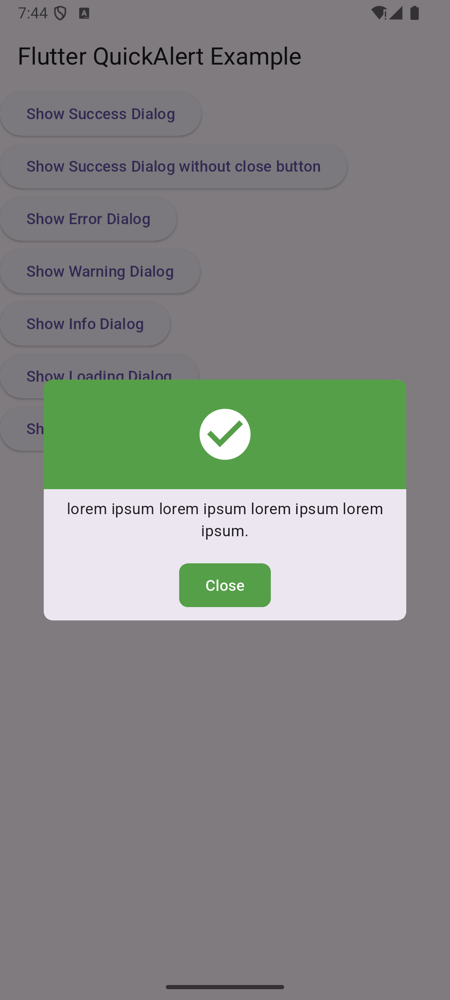
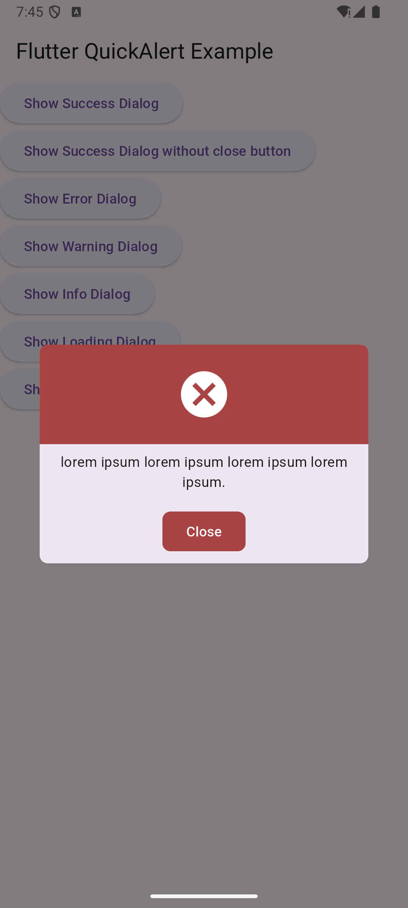
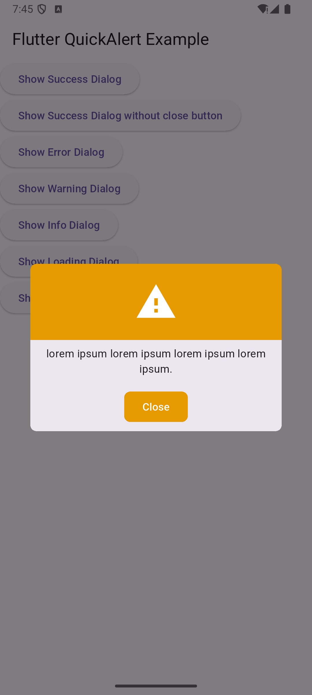
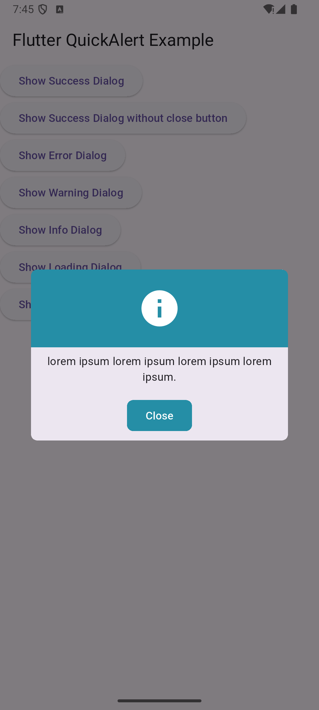
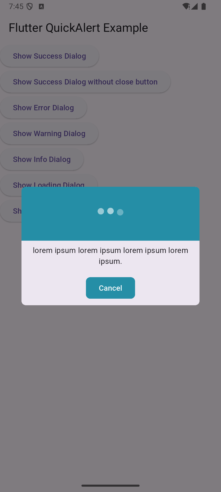
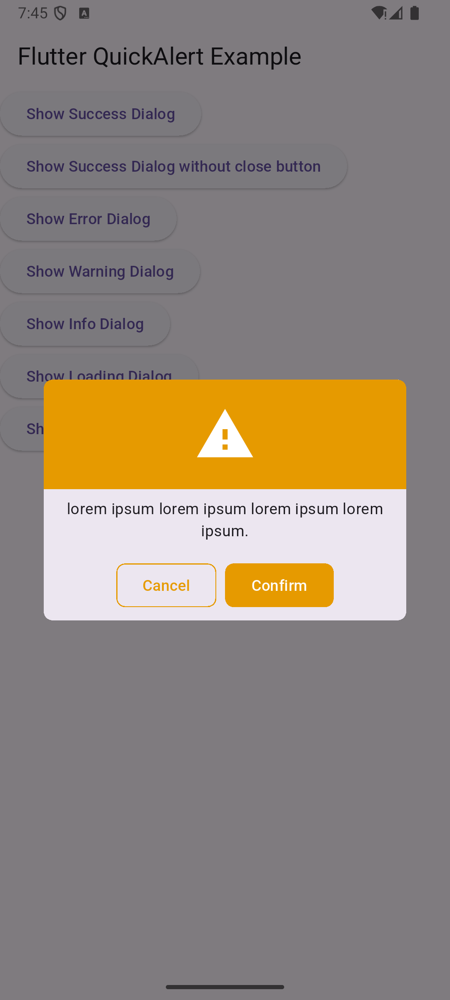

# Flutter Quick Alert

A lightweight and customizable alert dialog package for Flutter. Easily display success, error, warning, and info dialogs with various styles and themes.

## Features
- Supports different alert types: **Success, Error, Warning, Info**
- Customizable UI with `QuickAlertTheme`
- Multiple dialog styles: **Normal, Confirm, Loading**
- Options for close and cancel buttons
- Configurable dismiss behavior
- Built-in support for multiple languages
- Easy-to-use extensions for `BuildContext`

## Installation

Add the package to your `pubspec.yaml`:

```yaml
dependencies:
  flutter_quickalert: latest_version
```

Then, run:

```sh
flutter pub get
```

## Usage

### Basic Alert Dialog

```dart
import 'package:flutter/material.dart';
import 'package:flutter_quickalert/flutter_quickalert.dart';

void showAlert(BuildContext context) {
  QuickAlert.show(
    context: context,
    message: 'Operation Successful!',
    type: QuickAlertTypes.success,
  );
}
```

### Custom Dialog with Options

```dart
QuickAlert.show(
  context: context,
  message: 'Are you sure you want to proceed?',
  type: QuickAlertTypes.warning,
  dialogType: QuickAlertDialogTypes.confirm,
  showCancelButton: true,
  barrierDismissible: false,
);
```

### Theming with QuickAlertTheme

Customize the alert appearance by applying `QuickAlertTheme` to your app's theme:

```dart
ThemeData(
  extensions: <ThemeExtension<dynamic>>[
    QuickAlertTheme(
      success: Colors.green,
      error: Colors.red,
      warning: Colors.orange,
      info: Colors.blue,
      background: Colors.white,
      radius: 12,
    ),
  ],
);
```

### Using Extensions for Quick Alerts

```dart
import 'package:flutter/material.dart';
import 'package:flutter_quickalert/flutter_quickalert.dart';

void showAlerts(BuildContext context) {
  context.showAlert(
    message: 'This is an info alert!',
    type: QuickAlertTypes.info,
  );

  context.showLoadingAlert(
    message: 'Loading...',
    type: QuickAlertTypes.loading,
    onCanceled: (context) {
      print('Loading canceled');
    },
  );

  context.showConfirmAlert(
    message: 'Do you confirm this action?',
    type: QuickAlertTypes.confirm,
  );
}
```

## Available Dialog Types

```dart
enum QuickAlertTypes {
  success,
  error,
  warning,
  info,
}
```

```dart
enum QuickAlertDialogTypes {
  normal,
  confirm,
  loading,
}
```

## Screenshots

### Success Alert


### Error Alert


### Warning Alert


### Info Alert


### Loading Info Alert


### Confirm Warning Alert


## Contributions

Contributions are welcome! Feel free to open issues and submit pull requests.

## License

This package is available under the MIT License.

